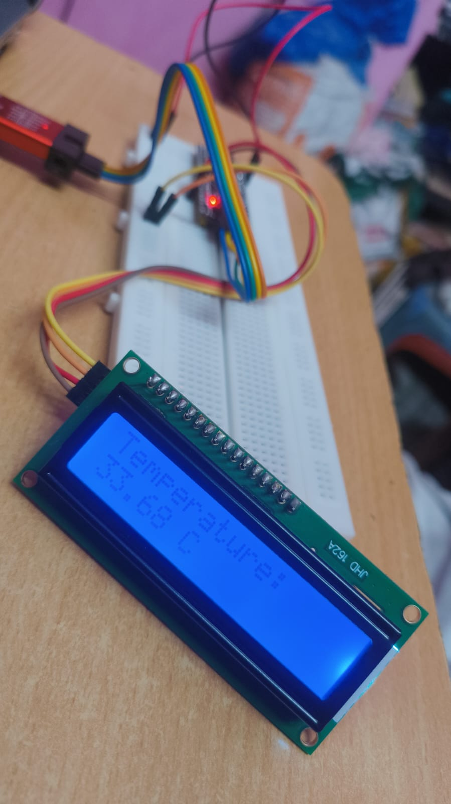

# STM32 Temperature Monitor

A real-time temperature monitoring system using STM32 microcontroller with LCD display output.



## Overview

This project implements a temperature monitoring system that reads the internal temperature sensor of an STM32 microcontroller and displays the temperature on an I2C LCD screen. The system uses DMA-based ADC conversion triggered by a timer for efficient operation.

## Features

- **Real-time Temperature Monitoring**: Continuous temperature reading from STM32's internal temperature sensor
- **LCD Display**: 16x2 I2C LCD for temperature display
- **DMA-based ADC**: Efficient ADC conversion using DMA transfer
- **Timer-triggered Conversion**: Timer 3 triggers ADC conversions for consistent sampling
- **Voltage Reference Compensation**: Uses internal voltage reference for accurate readings

## Hardware Requirements

### STM32 Microcontroller
- STM32F4xx series (tested on STM32F401/F411)
- External crystal oscillator (HSE)

### LCD Display
- 16x2 I2C LCD module
- I2C address: Standard (usually 0x27 or 0x3F)

### Connections
```
STM32          I2C LCD
PB6     -----> SCL
PB7     -----> SDA
3.3V    -----> VCC
GND     -----> GND
```

## Software Configuration

### Peripherals Used
- **ADC1**: 12-bit resolution, DMA mode
  - Channel 1: Internal voltage reference (VREFINT)
  - Channel 2: Internal temperature sensor (TEMPSENSOR)
- **Timer 3**: ADC trigger source
- **I2C1**: LCD communication
- **DMA2 Stream 0**: ADC data transfer

### Key Parameters
```c
#define VREFINT 1.21        // Internal reference voltage (V)
#define ADCMAX 4095.0       // 12-bit ADC maximum value
#define V25 0.76            // Temperature sensor voltage at 25°C
#define AVG_SLOPE 0.0025    // Temperature coefficient (2.5mV/°C)
```

## Temperature Calculation

The temperature is calculated using the STM32's internal temperature sensor:

```
Temperature = ((VTmpSens - V25) / AVG_SLOPE) + 25.0°C
```

Where:
- `VTmpSens` = Temperature sensor voltage (compensated with VREFINT)
- `V25` = Sensor voltage at 25°C (0.76V)
- `AVG_SLOPE` = Temperature coefficient (2.5mV/°C)

## System Operation

1. **Initialization**:
   - Configure system clock (84MHz from HSE + PLL)
   - Initialize ADC1 with DMA
   - Setup Timer 3 for ADC triggering
   - Initialize I2C1 for LCD communication

2. **Main Loop**:
   - Wait for ADC conversion completion (DMA callback)
   - Calculate temperature using voltage reference compensation
   - Update LCD display every 2 seconds
   - Repeat continuously

## Code Structure

```
main.c
├── System Initialization
│   ├── SystemClock_Config()
│   ├── MX_GPIO_Init()
│   ├── MX_DMA_Init()
│   ├── MX_ADC1_Init()
│   ├── MX_TIM3_Init()
│   └── MX_I2C1_Init()
├── Main Loop
│   ├── ADC Conversion Check
│   ├── Temperature Calculation
│   └── LCD Update
└── Interrupt Callbacks
    └── HAL_ADC_ConvCpltCallback()
```

## Performance Specifications

- **Update Rate**: 2 seconds per reading
- **Resolution**: 12-bit ADC (0.01°C display precision)
- **Range**: Typical -40°C to +85°C (STM32 operating range)
- **Accuracy**: ±2°C (typical for internal sensor)

## Build and Flash

1. **Prerequisites**:
   - STM32CubeIDE or compatible toolchain
   - STM32 HAL library
   - Custom LCD library (`LCD.h`)

2. **Build Process**:
   ```bash
   # Using STM32CubeIDE
   1. Import project
   2. Build project (Ctrl+B)
   3. Flash to target (F11)
   ```

## Troubleshooting

### Common Issues

1. **LCD Not Displaying**:
   - Check I2C connections (SDA/SCL)
   - Verify I2C address in LCD library
   - Ensure proper pull-up resistors

2. **Incorrect Temperature Readings**:
   - Verify VREFINT calibration value
   - Check ADC reference voltage
   - Ensure proper MCU temperature range

3. **Erratic Readings**:
   - Check for electromagnetic interference
   - Verify stable power supply
   - Ensure proper grounding

## Customization

### Changing Update Rate
Modify the delay in main loop:
```c
HAL_Delay(2000);  // Change value for different update rates
```

### Temperature Units
Add Fahrenheit conversion:
```c
double temp_fahrenheit = (Temperature * 9.0/5.0) + 32.0;
```

### Display Format
Modify LCD output format:
```c
sprintf(lcd_buffer, "%.1f°C", Temperature);  // 1 decimal place
```

## License

Copyright (c) 2025 STMicroelectronics.
All rights reserved.

This software is licensed under terms that can be found in the LICENSE file in the root directory of this software component.

## Contributing

1. Fork the repository
2. Create feature branch
3. Commit changes
4. Push to branch
5. Create Pull Request

## Support

For technical support and questions:
- Check STM32 community forums
- Refer to STM32 HAL documentation
- Review datasheet for specific MCU variant

## Contact
 
For doubts and queries:
- email : mukeshkumar.cse24@gmail.com