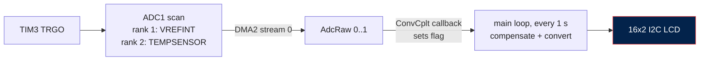

<div align="center">


<a href="#-how-it-works"></a>

<br/>

[](https://www.st.com/en/microcontrollers-microprocessors/stm32f401cc.html)
[](Core/Src/main.c)
[](#-how-it-works)
[](https://www.st.com/en/development-tools/stm32cubeide.html)
<br/>
[](#-status-and-ideas)
[](LICENSE)

</div>

---

##  Project Overview

No external sensor needed: the **STM32F401's built-in temperature sensor** is read together with the **internal voltage reference (VREFINT)**, so the result does not depend on the exact supply voltage. The temperature is shown on a **16x2 I2C LCD**.

<div align="center">

</div>

### Key Features

-  **Internal sensor**: ADC1 channel TEMPSENSOR, 480-cycle sampling as the datasheet requires.
-  **VREFINT compensation**: the reference channel is converted in the same scan to work out the real ADC supply voltage.
-  **Scan + DMA**: both channels in one sequence, triggered by TIM3, written straight into `AdcRaw[2]`.
-  **LCD readout**: `Temperature:` / `xx.xx C`, refreshed every second.

##  How It Works



```
VDDA       = 1.21 V × 4095 / AdcRaw[0]          (VREFINT, nominal 1.21 V)
V_sense    = VDDA × AdcRaw[1] / 4095
T (°C)     = (V_sense − 0.76 V) / 0.0025 V/°C + 25
```

`V25 = 0.76 V` and `Avg_Slope = 2.5 mV/°C` are the typical values from the STM32F401 datasheet.

##  Wiring

| From | To (STM32F401CCU6) | Notes |
|---|---|---|
| LCD backpack SCL | PB6 | I2C1, 100 kHz, open-drain with pull-ups |
| LCD backpack SDA | PB7 | |
| LCD backpack VCC / GND | 5V / GND | |
| ST-Link SWDIO / SWCLK | PA13 / PA14 | Programming |

Clock: 25 MHz HSE → PLL (M=25, N=168, P=2) → 84 MHz.

##  Build and Flash

1. Open the project in **STM32CubeIDE** (or open `Temperature-Sensor.ioc`).
2. Enable float formatting for `sprintf` (Project Properties → C/C++ Build → MCU Settings → *Use float with printf*), otherwise the LCD shows an empty number.
3. Build, connect the ST-Link, and Run.
4. The LCD shows `Temp Monitor` for two seconds, then the live temperature.

To change the refresh rate, edit `HAL_Delay(1000)` in the main loop. For Fahrenheit: `Temperature * 9.0 / 5.0 + 32.0`.

##  Troubleshooting

| Symptom | Check |
|---|---|
| LCD blank | PB6/PB7 wiring, 5V supply, contrast pot, I2C address in `LCD.h` (0x27 or 0x3F) |
| Number missing after `C` | Float printf support not enabled |
| Reading a few degrees off | Expected with typical V25/slope values; see the calibration idea below |
| Reading never changes | DMA interrupt enabled; TIM3 started; ADC started with length 2 |

##  Project Structure

```
IntTemp-Sensor-STM32F401/
├── Core/
│   ├── Inc/LCD.h              # LCD driver API
│   ├── Src/LCD.c              # HD44780 4-bit driver over PCF8574
│   └── Src/main.c             # ADC scan + DMA, TIM3, conversion, display
├── Drivers/                   # STM32 HAL and CMSIS (generated)
├── Temperature-Sensor.ioc     # CubeMX configuration
└── output.jpeg
```

##  Status and Ideas

Complete and working (June 2025). The internal sensor measures the **die temperature**, which runs a little above room temperature while the chip is working, and typical accuracy with datasheet constants is about ±1.5 to 2 °C.

Possible improvements:
- Use the factory calibration values stored in the chip (`VREFINT_CAL`, and `TS_CAL1` / `TS_CAL2` at 30 °C and 110 °C) instead of the typical constants
- Average several samples per reading
- Drive the display from the DMA callback instead of a fixed delay

##  License

My code (`LCD.c`, `LCD.h` and the `USER CODE` sections of `main.c`) is MIT, see [LICENSE](LICENSE). Files generated by STM32CubeMX and everything under `Drivers/` remain under STMicroelectronics' and Arm's licenses stated in those files.

Questions: mukeshkumar.cse24@gmail.com

<div align="center">


</div>
